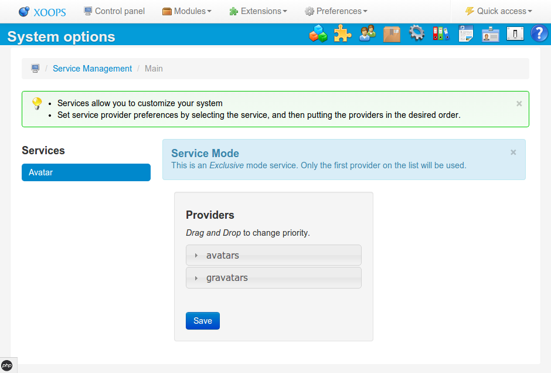

### Service Manager Administration

* For simple cases, just install the **provider module/extension** and it will just work.

* For more complex cases use the services section in the administration area

