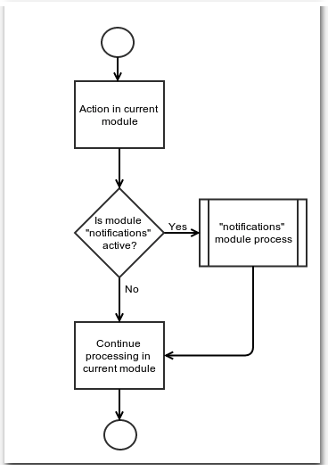

# Service Manager Evolution

## Service Management

In XOOPS 2.6.0 alpha 2, some familiar services that were traditionally internal parts of the core were separated into modules.

Some examples are:

* avatars, 
* comments, and 
* notifications

## Separated Module Benefits

The separated module approach achieves some important benefits:

* Modules can be updated independently. 
* Modules can have private resources, such as: 
  * templates, 
  * configurations, 
  * maintenance pages. 
* Modules can be omitted if not needed, saving some resources.

## Problems with Separation

However, there are potential benefits to separation that were not realized:

* The service modules were not easily replaced with alternate implementations 
* References using hard coded module names litter the entire system wherever a service is needed

## Direct Module Connection

* Each time the service is used, the calling code must check to see if module is installed 
* Usage generally requires intimate knowledge of the service internals

